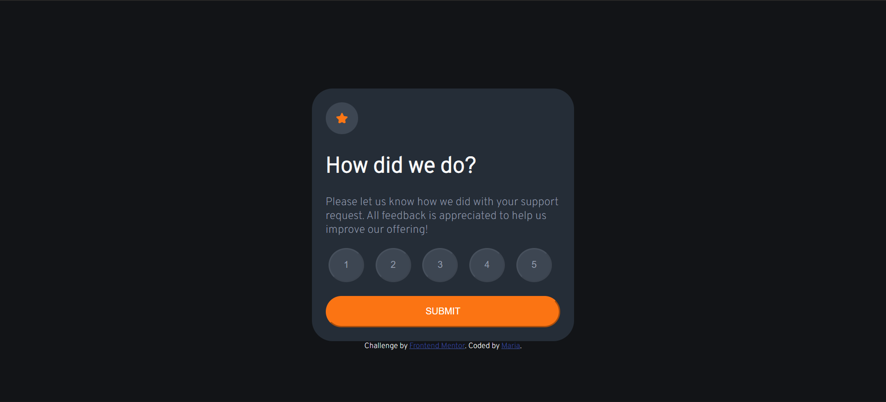
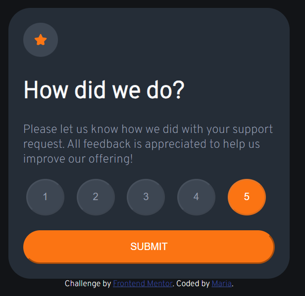
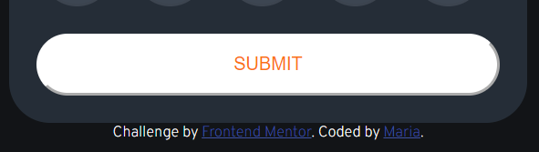
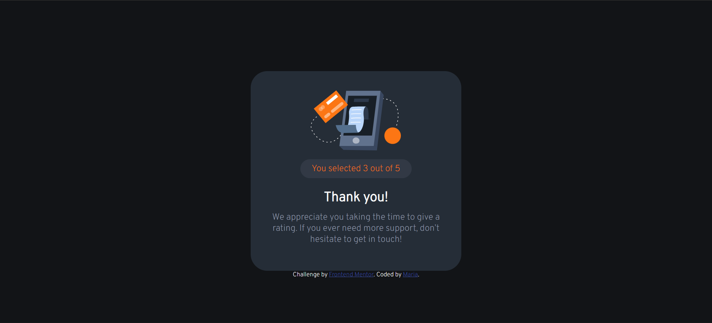
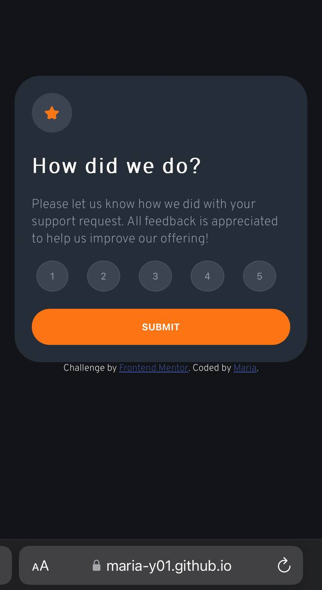
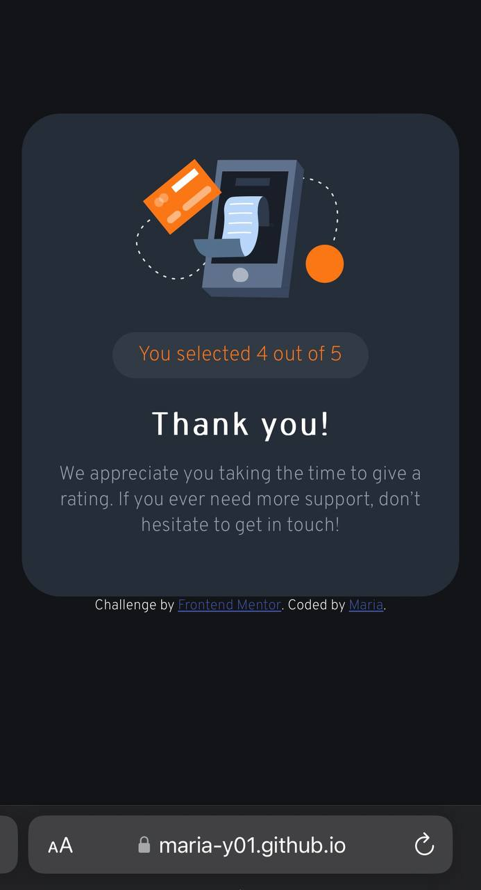

# Interactive rating component solution

This is a solution to the [Interactive rating component challenge on Frontend Mentor](https://www.frontendmentor.io/challenges/interactive-rating-component-koxpeBUmI). Frontend Mentor challenges help you improve your coding skills by building realistic projects. 

## Table of contents

- [Overview](#overview)
  - [The challenge](#the-challenge)
  - [Screenshots](#screenshots)
- [My process](#my-process)
  - [Built with](#built-with)
  - [Useful resources](#useful-resources)
- [Author](#author)

## Overview

### The challenge

Users should be able to:

- View the optimal layout for the app depending on their device's screen size
- See hover states for all interactive elements on the page
- Select and submit a number rating
- See the "Thank you" card state after submitting a rating

### Screenshots

## My process

### Built with

- Semantic HTML5 markup
- CSS custom properties
- Flexbox
- Mobile-first workflow
- JavaScript

### Useful resources

- [W3 schools](https://www.w3schools.com/) - This is an amazing website which helped me with different questions during my work. I'd recommend it to anyone.

## Author

- LinkedIn - [Maria Jankowska](https://www.linkedin.com/in/maria-jankowska-632041240/)
- Frontend Mentor - [@Maria-Y01](https://www.frontendmentor.io/profile/Maria-Y01)
